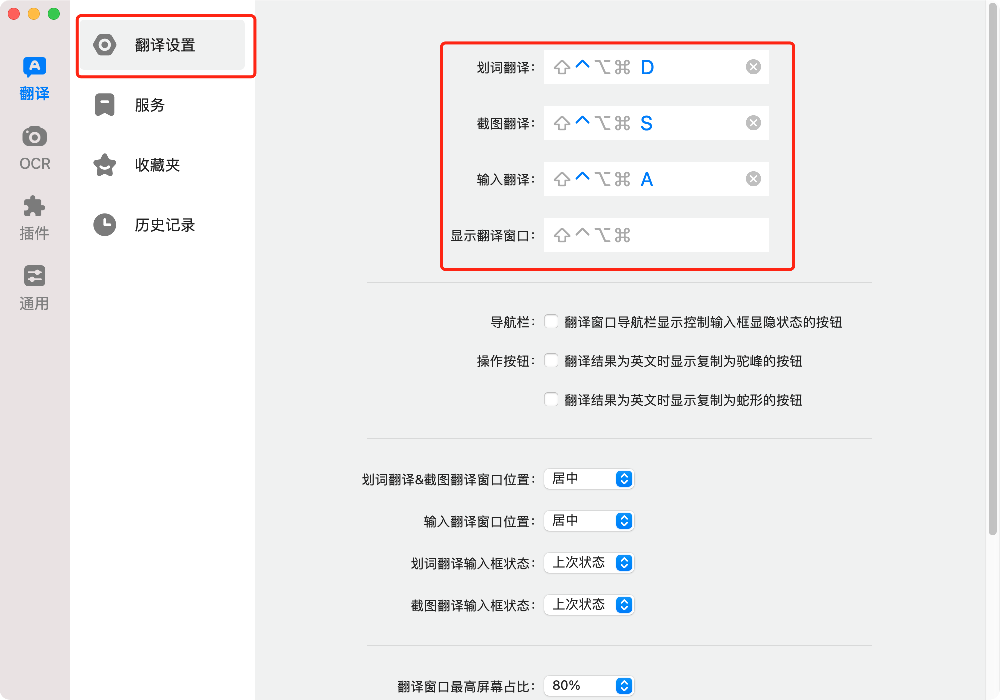
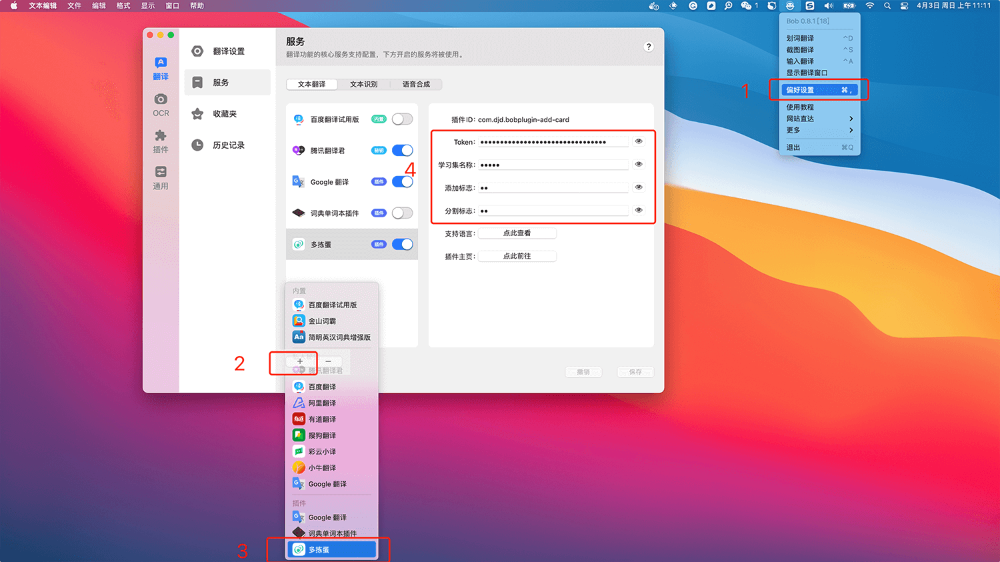
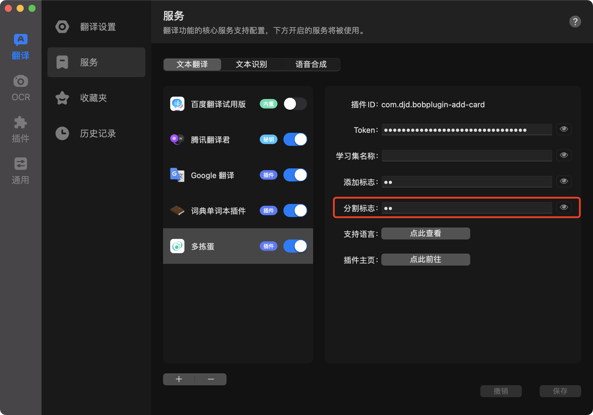
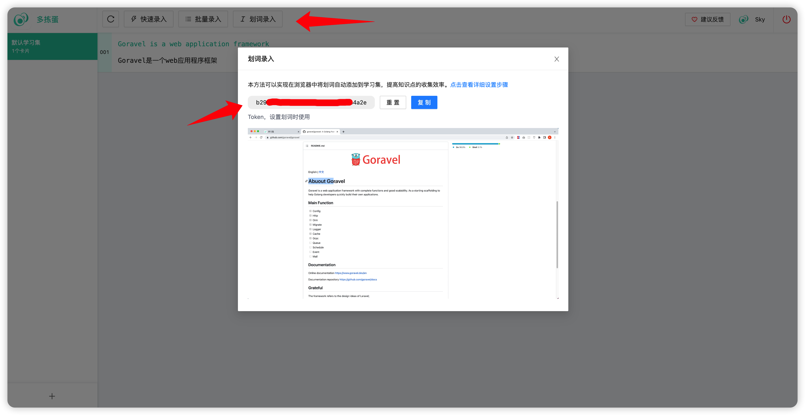
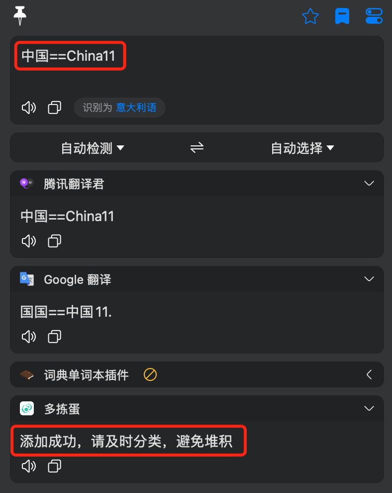

# bobplugin-add-card

这是一个 [Bob](https://github.com/ripperhe/Bob) 的插件，将搜索的词条很便捷的添加到「多拣蛋微信小程序」的学习集中。然后可以随时随地的通过小程序进行卡片的学习，提升学习效率。

## 特性

1. 支持添加卡片到特定的学习集；
2. 支持设置特定添加标志，控制是否添加到学习集；
3. 支持设置特定的分割标志，区分添加卡片正反面；

## 安装

1. 安装 [Bob](https://github.com/ripperhe/Bob)；
2. 下载插件 [bobplugin_add_card.bobplugin](https://github.com/duo-jian-dan/bobplugin-add-card/releases/download/1.0.1/bobplugin-add-card.bobplugin)，双击安装；
3. 根据下面文档，进行初始化设置；

## Bob 设置

1. 设置 Bob 快捷键；

2. 进入 Bob 设置页面，根据下图步骤启用「多拣蛋 Bob 插件」;

## 多拣蛋 Bob 插件设置

1. Token。在「多拣蛋微信小程序 - 我的 - 开放平台」的中获取。

2. 学习集名称。选填，为空时，默认学习集名称为「默认学习集」，如果学习集超过最大容量（200 个卡片），将自动创建同名学习集。

3. 添加标志。选填，当文本匹配到设置的「添加标志」时，触发添加卡片到学习集的流程。当为空时，直接触发。

   例如设置「学习集名称」为「Go 开发框架」，「添加标志」为「11」，则当文本为「Goravel11」时，将添加正面为「Goravel」、反面为「空」的卡片到学习集「Go 开发框架」。

4. 分割标志。当文本中存在「分割标志」时，文本将会被拆分成卡片的「正反面」。

   例如设置「学习集名称」为「Go 开发框架」，「分割标志」为「==」，「添加标志」为「11」，则当文本为「Goravel==很棒的 Go 开发框架 11」时，将添加正面为「Goravel」，反面为「很棒的 Go 开发框架」的卡片到学习集「Go 开发框架」。

## 效果

当添加成功时，会提示「添加成功，请及时分类，避免堆积」。

## 错误提示

1. 当设置了「添加标志」，但文本没有匹配到时，会提示「未检测到添加标志：\*\*」；
2. 当添加的文本有敏感词时，会提示「卡片添加失败：包含敏感词请修改：\*\*」；
3. 当遇到其他未知错误时，会提示「卡片添加失败：\*\*」；

## 注意

1. Bob 会自动将 「--」合并为「—」 ，导致设置的「添加标志」「分割标志」无法识别，不推荐使用该标志；
2. 由于 Bob 兼容问题，无法使用「\r\n」等换行符号设置为「添加标志」「分割标志」；
