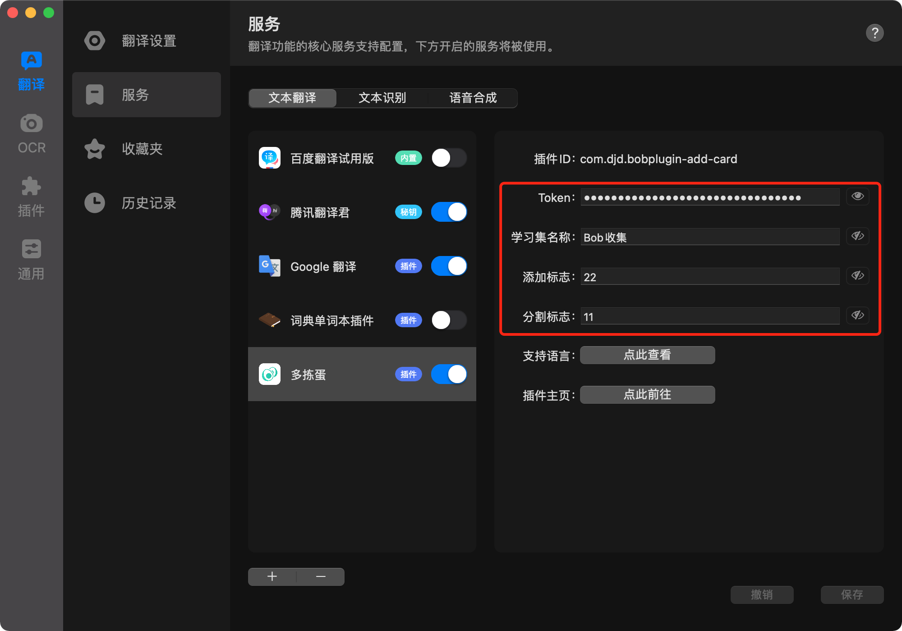

# bobplugin-add-card

这是一个 [Bob](https://github.com/ripperhe/Bob) 的插件，将搜索的词条很便捷的添加到「多拣蛋微信小程序」的学习集中。然后可以随时随地的通过小程序进行卡片的学习，提升学习效率。

## 安装

1. 安装 [Bob](https://github.com/ripperhe/Bob)；
2. 下载文件 [bobplugin_add_card.bobplugin]()，双击安装；
3. 根据下面文档，进行初始化设置；

## 特性

1. 支持添加卡片到特定的学习集；
2. 支持设置特定添加标志，控制是否添加到学习集；
3. 支持设置特定的分割标志，区分添加卡片正反面；

## 设置

### 学习集名称

选填，为空时，默认学习集名称为「默认学习集」，如果学习集超过最大容量，将自动创建同名学习集。

### 添加标志

选填，当文本匹配到设置的「添加标志」时，触发添加卡片到学习集的流程。当为空时，直接触发。

例如设置「学习集名称」为「国家」，「添加标志」为「11」，则当文本为「中国 11」时，将添加正面为「中国」、反面为「空」的卡片到学习集「国家」。

### 分割标志

当文本中存在「分割标志」时，文本将会被拆分成卡片的「正反面」。

例如设置「学习集名称」为「国家」，「分割标志」为「==」，「添加标志」为「11」，则当文本为「中国==China11」时，将添加正面为「中国」，反面为「China」的卡片到学习集「国家」。

## 效果

当添加成功时，会提示「添加成功，请及时分类，避免堆积」。

## 错误

1. 当设置了「添加标志」，但文本没有匹配到时，会提示「未检测到添加标志：\*\*」；
2. 当添加的文本有敏感词时，会提示「卡片添加失败：包含敏感词请修改：\*\*」；
3. 当遇到其他未知错误时，会提示「卡片添加失败：\*\*」；

## 注意

1. Bob 会自动将 「--」合并为「—」 ，导致设置的「添加标志」「分割标志」无法识别，不推荐使用该标志；
2. 由于 Bob 兼容问题，无法使用「\r\n」等换行符号设置为「添加标志」「分割标志」；
